# Promatch - Fun Mod for Call of Duty 4: Modern Warfare

**Promatch** was originally a competitive mod for **Call of Duty 4: Modern Warfare**, designed to offer advanced and customizable gameplay. However, as the professional competitive scene for **Call of Duty 4** has been dead for many years, **Promatch** evolved into a mod primarily aimed at **fun**, with custom weapons, game modes, and bot systems for a more relaxed and enjoyable experience.

The mod became incredibly popular on my own server, where players enjoyed it for over **8 years**. Unfortunately, since I have moved on and there aren’t as many players anymore, the server is now closed. But it was an amazing journey filled with great moments with friends and countless hours of coding, testing, and improving the mod.

---

## Overview

Promatch is a deeply customizable **Call of Duty 4: Modern Warfare** mod, offering a vast range of features such as custom **weapons**, **damage systems**, **player abilities**, **game modes**, **bots**, and more. Initially developed for competitive play, **Promatch** is now enjoyed for fun and casual gaming, with added bots, unique weapon effects, and a variety of new game modes that bring fresh enjoyment to the game.

The mod was created using **GSC (Game Script Code)**, based on **C++**, allowing for deep customization of the game’s core systems.

---

## Features

### 1. **Advanced Weapon Configurations**

* **Custom damage** values for each weapon.
* Adjustable **fire rates**, **reload speeds**, and **ammo counts**.
* **Special Ammo Types** like **FMJ**, **HP Ammo**, **subsonic bullets**.
* **New Weapons**: **Springfield**, **Colt45**, **Wa2000**, **AN94**, **MSR**, **Magnum500**, **R516**.

### 2. **Damage System**

* **Dynamic damage scaling** based on distance, weapon type, and player status.
* Custom **health mechanics** and player damage customization.

### 3. **Player Customization**

* **Custom health**, **armor**, and **abilities** for players.
* **Medic System**: Players can revive fallen teammates, adding tactical gameplay.

### 4. **Score System**

* **Custom score tracking** with integrated **HUD** showing player performance metrics.

### 5. **Bot AI and Features**

Main bots code is a updated code for be compatible only with this mod.
* **Bot System**: Bots now move, use weapons, and revive players.
* **Medic Bots**: Bots can heal and revive players.
* **Bot Ranks**: Bots now have different difficulty levels based on player rank.

Original code from:
https://github.com/ineedbots/iw3_bot_warfare

### 6. **Custom Menus**

* **Quick Music Menu** (`quickmusic.menu`).
* **Server Info Menu** (`serverinfo.menu`).
* **Spray Menu** (`spray.menu`).
* **Vote Menu** (`vote.menu`).
* **Class Change Menu** (`changeclass_mw.menu`).
* **Quick Buy Menu** (`quickbuy.menu`).

---

## File Structure

Here’s a simple file structure of the **Promatch** mod:

```
Promatch/
├── scripts/
│   ├── _globalinit.gsc               # Global initialization settings
│   ├── _guidcs.gsc                   # Player data persistence and management
│   ├── _scoresystem.gsc              # Score tracking and leaderboard
│   ├── _finalkillcam.gsc             # Custom final killcam system
│   ├── _ranksystem.gsc               # Player rank system
│   ├── _realtimestats.gsc            # Real-time stats tracking
│   ├── _carepackage.gsc              # Care package system
│   ├── _vote.gsc                     # Vote system for maps/modes
│   ├── squadmenu.inc                 # Squad/team menu interface
│   ├── upgradetree.inc               # Player upgrade system
│   ├── main.menu                     # Main menu interface
│   ├── quickmusic.menu               # Music control during gameplay
│   ├── serverinfo.menu               # Server info display
│   ├── spray.menu                    # Spray and player tag customization
│   ├── quickbuy.menu                 # Quick buy menu
│   ├── emblemas.menu                 # Emblem and badge customization
│   ├── changeclass_mw.menu           # Class change menu
│   ├── filmtweaks.menu               # Menu for film tweaks
│   └── medalsinfo.inc                # Medals system for player achievements
├── README.md                         # This file
└── License.txt                       # License file (MIT License)
```


## Contribution

Though **Promatch** was initially developed solo, contributions are always welcome! If you have any suggestions, improvements, or fixes, feel free to submit a pull request.

---

## License

**Promatch** is released under the **MIT License**, which allows for modification, redistribution, and use, provided the following conditions are met:

* **Call of Duty 4** and its related assets, including graphics, sounds, and intellectual property, remain the property of **Activision** and **Infinity Ward**. This mod **does not** claim any rights over the original game, and **Promatch** is intended purely as a mod to enhance the gameplay experience for **Call of Duty 4: Modern Warfare**.
* **Promatch** is an unofficial fan-created mod and is **not affiliated with or endorsed by Activision or Infinity Ward**.
* You may freely modify, distribute, or use **Promatch** in accordance with the MIT License, but you may **not** distribute **Call of Duty 4** or any official assets.

The mod **Promatch** is offered for free. Any use of the original game's intellectual property is done so under the understanding that **Activision** retains ownership of **Call of Duty 4: Modern Warfare** and its related assets.

---

## Acknowledgements

* **GSC (Game Script Code)** for enabling custom game scripting.
* **C++** for serving as the foundation for **GSC**, allowing for powerful game modifications.
* **Activision** and **Infinity Ward** for creating **Call of Duty 4: Modern Warfare**, the game that inspired this mod.

---

This version of the **README.md** includes the licensing information that clarifies **Promatch**'s status as a mod for **Call of Duty 4: Modern Warfare** and protects you legally by indicating that **Promatch** is not affiliated with or endorsed by the official game developers.


## Images

### 2017

- **Menu2017-a.bmp**
  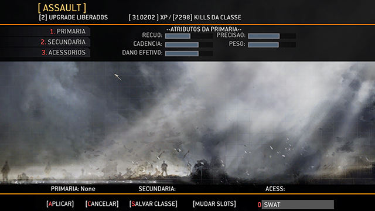

### 2018

- **Menu2018-a.jpg**
  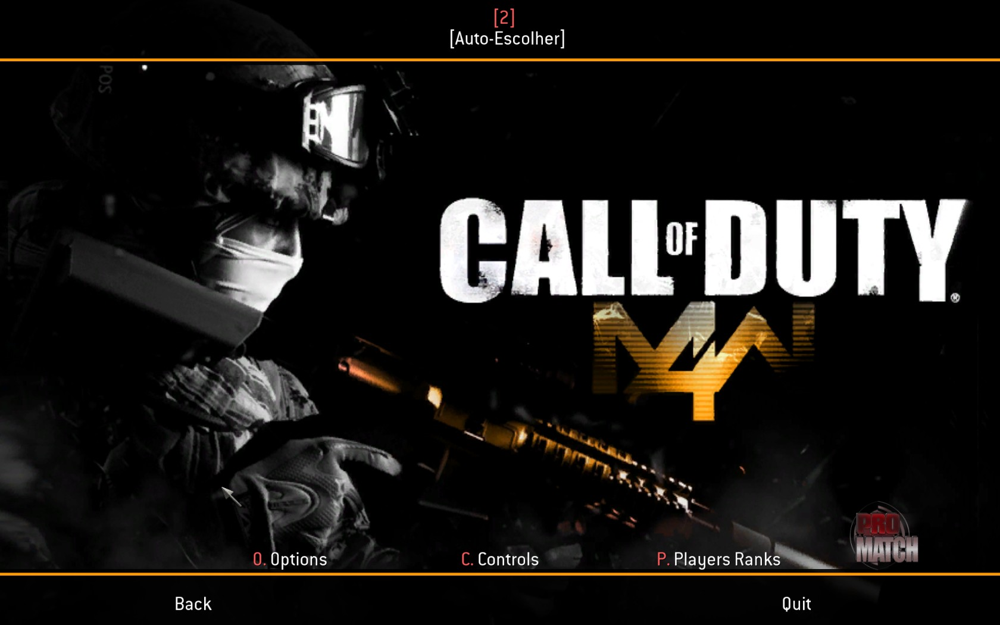

- **Menu2018-b.jpg**
  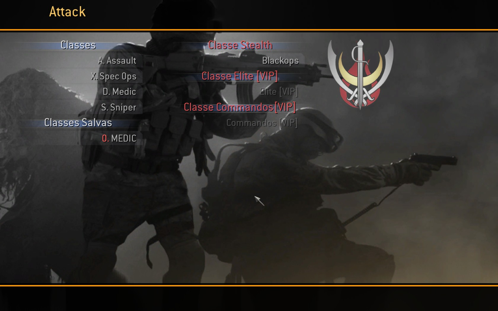

- **Menu2018-c.jpg**
  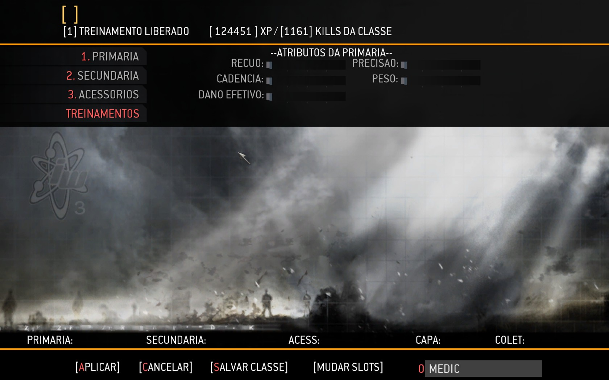

- **Menu2018-d.jpg**
  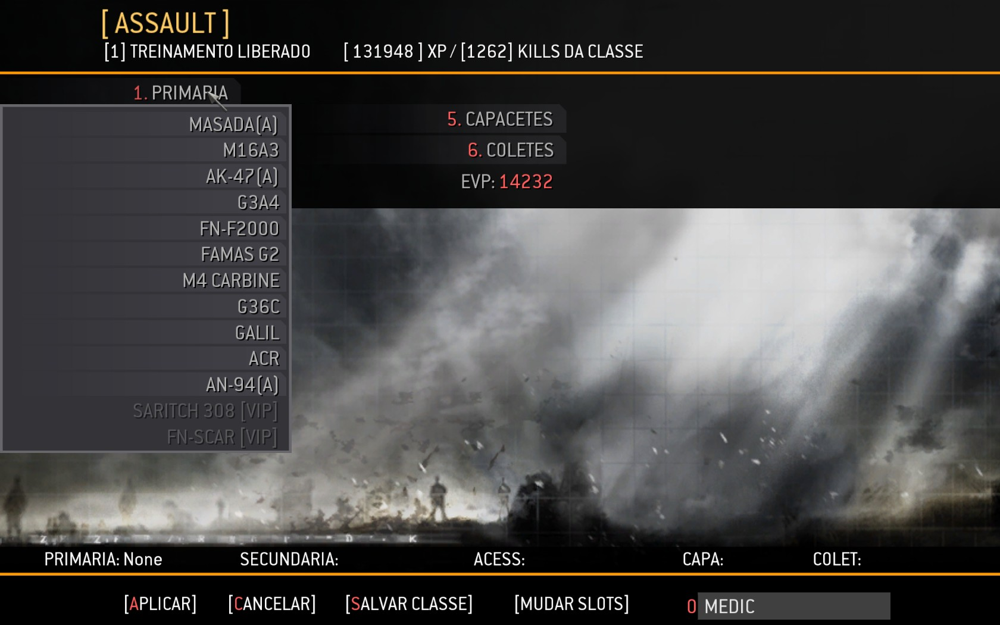

### 2019

- **Menu2019-a.png**
  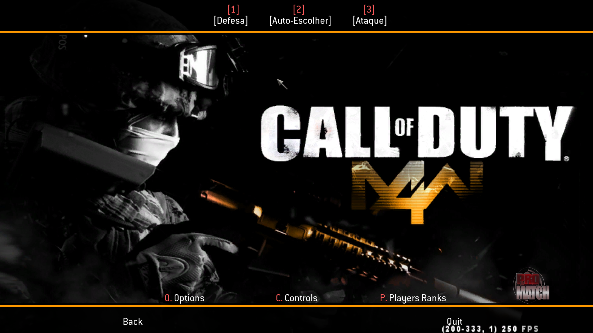

- **Menu2019-b.png**
  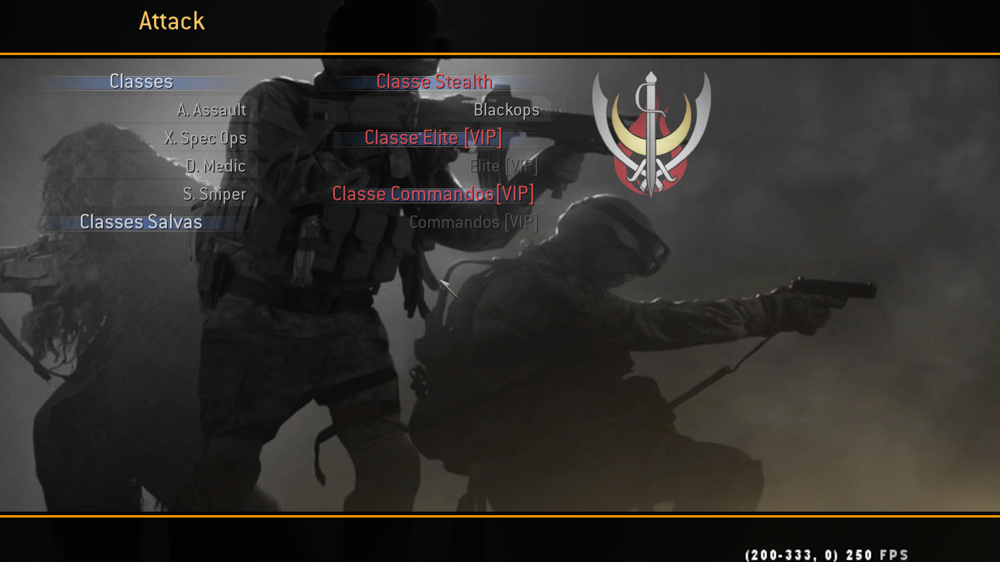

- **Menu2019-c.png**
  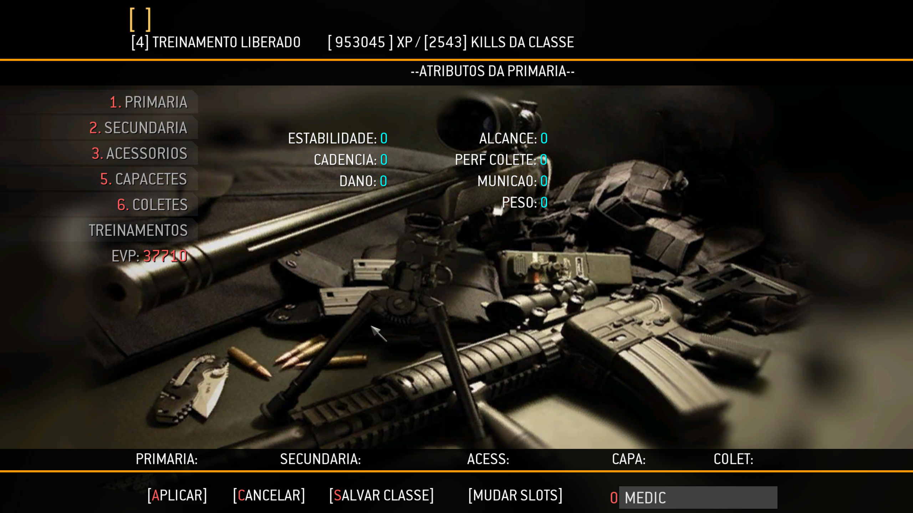

- **Menu2019-d.png**
  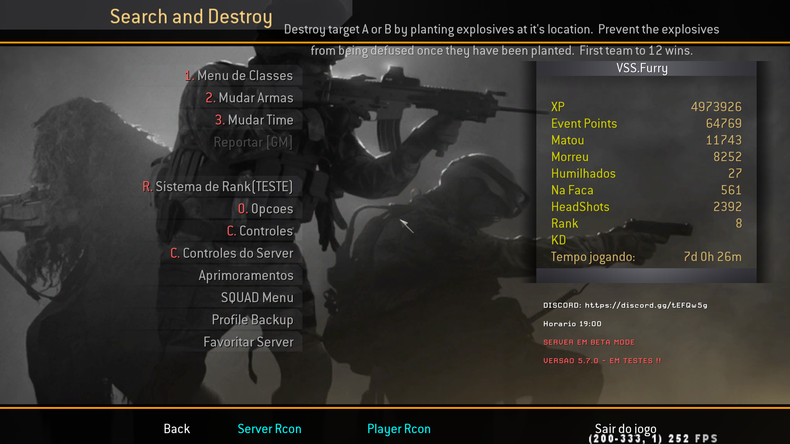

- **Menu2019-e.png**
  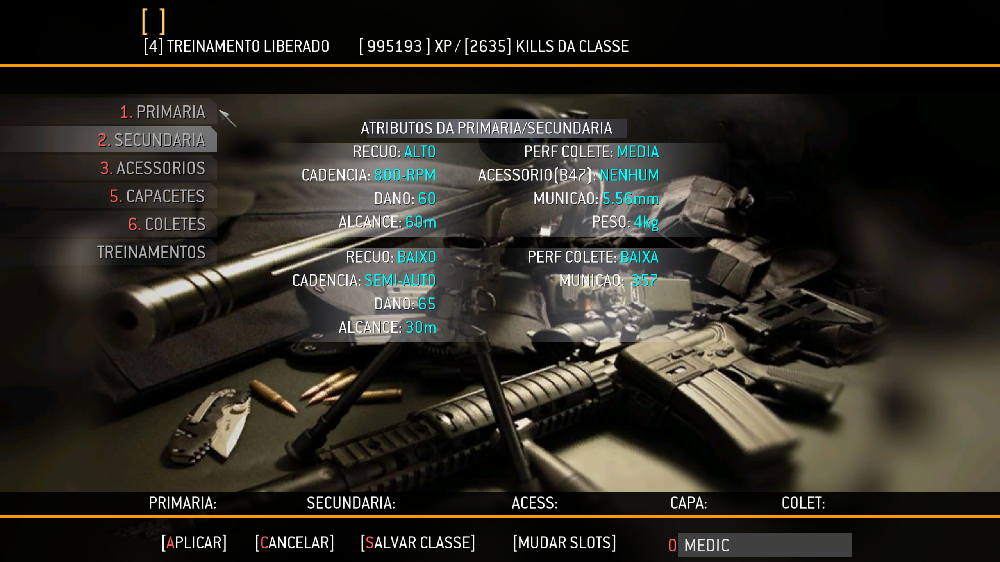

- **Menu2019-f.png**
  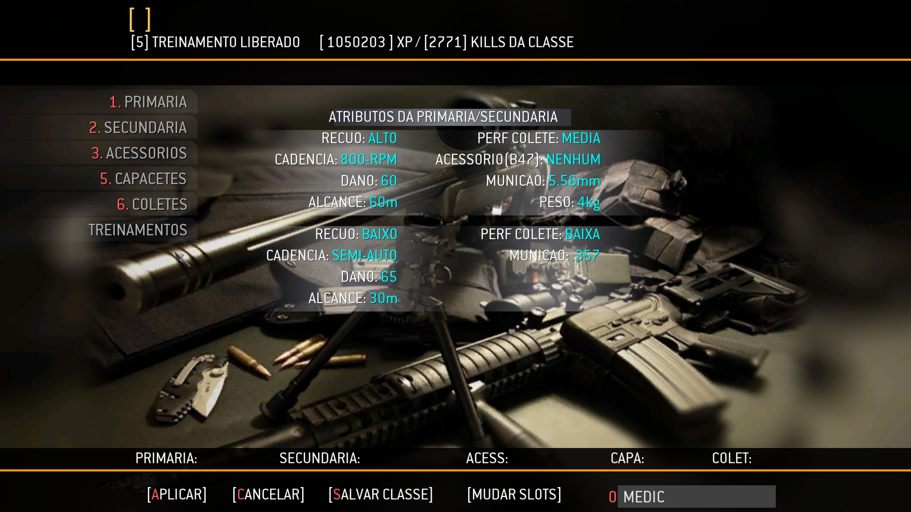

- **Menu2019-g.png**
  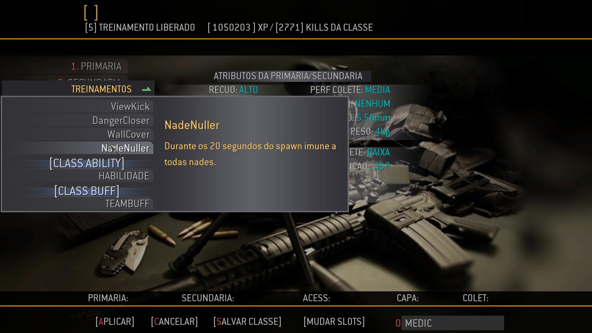

- **Menu2019-h.png**
  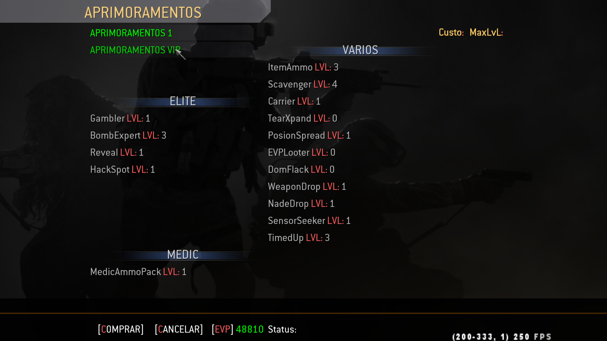

### 2020

- **Menu2020-a.png**
  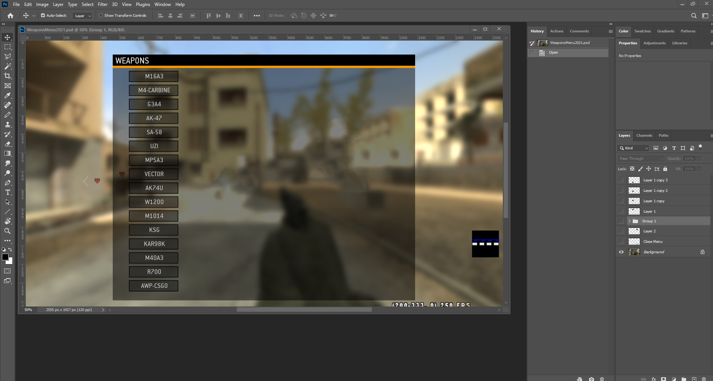

### Logo

- **VSSnewlogo.png**
  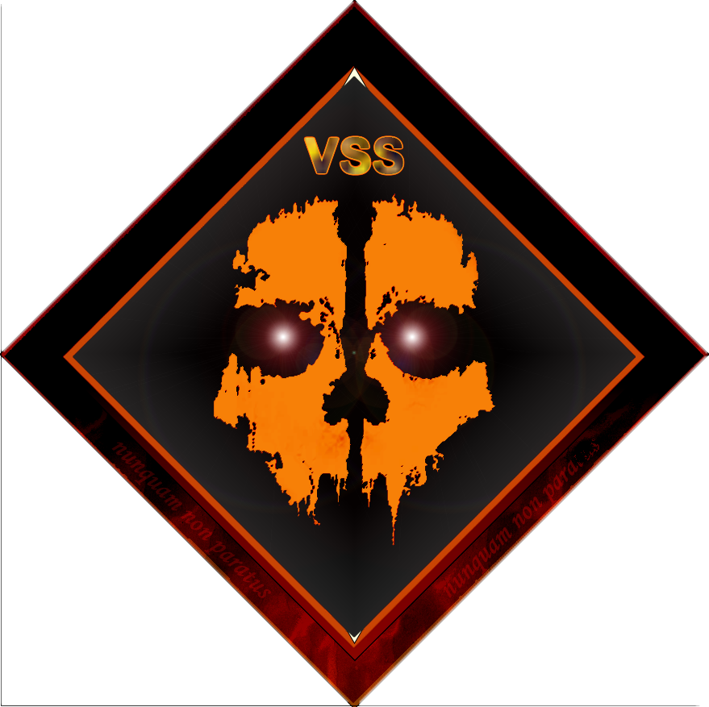
  
### 2024

- **Menu2024-a.png**
  
  


- **Menu2024-b.png**
  


- **Menu2024-c.png**
  
  
  
- **Menu2024-d.png**
  
  
  
- **Menu2024-e.png**
  
  
  